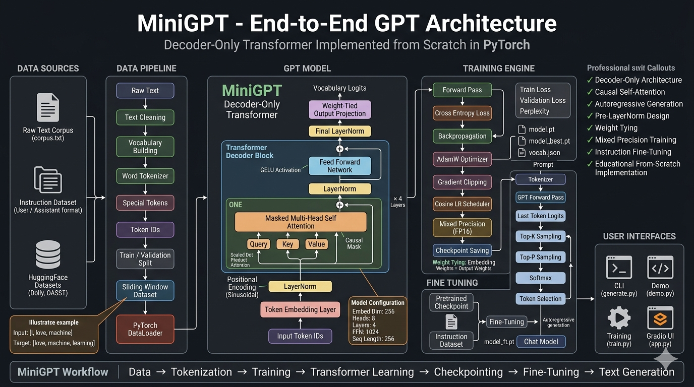
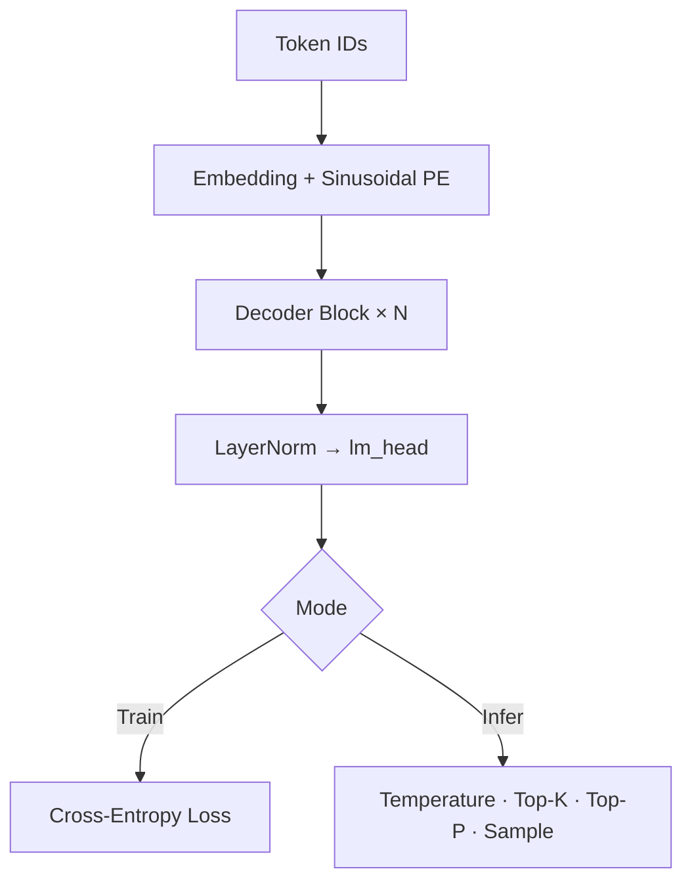

# MiniGPT

MiniGPT is a decoder-only GPT-style Transformer implemented entirely from scratch in PyTorch. It recreates the core building blocks behind modern large language models including causal self-attention, multi-head attention, Pre-LayerNorm transformer blocks, sinusoidal positional encoding, weight tying, and autoregressive text generation without relying on Hugging Face model abstractions.



---

## Highlights

Decoder-only GPT · Multi-head causal self-attention · Pre-LayerNorm · Sinusoidal PE · Weight tying · AdamW + cosine LR · FP16 AMP · Top-K / Top-P sampling · Instruction fine-tuning · Gradio UI

---

## Architecture

```
Token IDs → Embedding (×√d) → Positional Encoding
         → N × [LayerNorm → Masked MHA → +residual → LayerNorm → FFN(GELU) → +residual]
         → LayerNorm → lm_head (weight-tied) → logits → next-token prediction
```



| Component | Implementation | Why |
| --- | --- | --- |
| **Attention** | `softmax(QKᵀ/√d_k) · V`, fused QKV projection | Standard scaled dot-product; multi-head captures parallel patterns |
| **Causal mask** | Lower-triangular; future tokens → `-∞` | Autoregressive — no peeking at future tokens |
| **FFN** | `Linear → GELU → Linear` (4× expansion) | GPT-2/3 activation choice |
| **Pre-LN** | Normalize before attention/FFN | Stable training without heavy warmup |
| **Weight tying** | `lm_head.weight = embedding.weight` | Fewer params; shared input/output space |

**Training objective:** shifted next-token prediction with cross-entropy. Input `x` predicts target `y` one position ahead. Perplexity = `exp(loss)`.

**Default config:** 4 layers · 8 heads · 256 embed · 256 seq_len · 12K vocab (`config.py`)

---

## Pipelines

**Data:** `corpus.txt` → tokenize → build vocab → encode → sliding windows `(x, y)` → DataLoader

**Train:** forward → loss → backward → grad clip → AdamW → val eval → checkpoint (`model_best.pt`, `vocab.json`)

**Generate:** prompt → encode → autoregressive loop (repetition penalty → temperature → top-k → top-p → sample) → decode

**Fine-tune:** load `model_best.pt` + existing vocab → train on `User: …\nAssistant: …` pairs → save `model_ft.pt`

| Training | Choice |
| --- | --- |
| Optimizer | AdamW (`lr=1e-4`, `weight_decay=0.01`) |
| Scheduler | Cosine annealing (per-step) |
| Precision | FP16 AMP on CUDA |
| Gradient clip | `max_norm=1.0` |
| Loss | Cross-entropy |

---

## Project Structure

```
MiniGPT/
├── model.py              # Transformer architecture + generate()
├── tokenizer.py          # WordTokenizer, CharTokenizer
├── dataset.py            # Sliding-window TextDataset
├── train.py              # Training, checkpointing, fine-tuning
├── generate.py           # CLI inference / REPL
├── config.py             # Hyperparameters + presets
├── demo.py               # CPU demo (no external data)
├── download_hf_corpus.py # HF datasets → corpus
├── app.py                # Gradio playground
├── data/                 # corpus.txt, instruction.txt
└── checkpoints/          # vocab.json, *.pt (gitignored)
```

---

## Model Presets

| Config | Layers | Heads | Embed | Seq Len | Vocab |
| --- | ---: | ---: | ---: | ---: | ---: |
| `tiny_config()` | 2 | 2 | 64 | 64 | 3K |
| `small_config()` | 4 | 8 | 256 | 256 | 12K |
| `medium_config()` | 4 | 8 | 256 | 256 | 12K |

---

## Quick Start

```bash
pip install torch                    # core
pip install gradio datasets          # optional: UI + HF download

python demo.py                       # train + generate (no data needed)

python train.py --data data/corpus.txt --epochs 10
python train.py --finetune --data data/instruction.txt

python generate.py --prompt "Once upon a time" --interactive
python app.py                        # Gradio UI → http://127.0.0.1:7860
```

Download instruction data:

```bash
python download_hf_corpus.py --dataset dolly --out data/corpus.txt
```

---

## Engineering Notes

| Choice | Rationale |
| --- | --- |
| Decoder-only | Pure language modeling; matches GPT |
| Sinusoidal PE | Parameter-free baseline (vs RoPE in modern LLMs) |
| Word-level tokenizer | Simple, readable — BPE would handle OOV better |
| Top-K + Top-P | Practical decode quality without beam search |

**Future:** RoPE, BPE tokenizer, Flash Attention, LoRA, KV-cache, quantization

---

## License

MIT — see [LICENSE](LICENSE). Copyright (c) 2026 Piyush Bafna.
