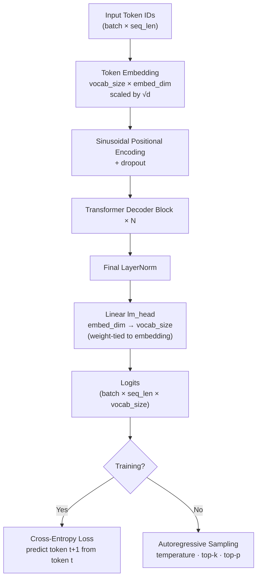
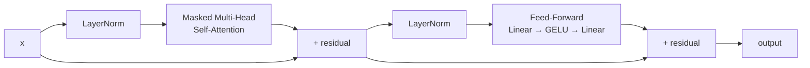
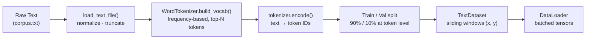
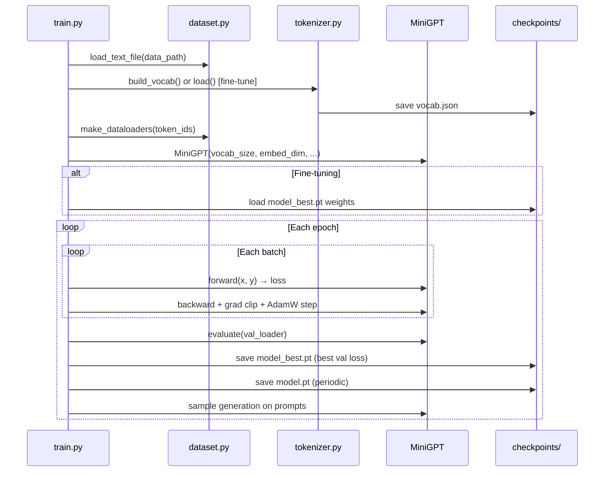
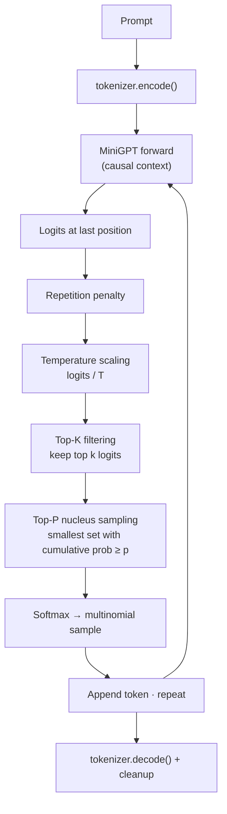

# MiniGPT

[](https://www.python.org/downloads/)
[](https://pytorch.org/)
[](LICENSE)

A **decoder-only GPT-style Transformer** implemented from scratch in PyTorch. Every major component — causal self-attention, Pre-LayerNorm blocks, positional encoding, weight tying, and autoregressive generation — is written explicitly in `model.py`, without Hugging Face or high-level transformer abstractions.

MiniGPT is designed as an **educational language model**: you can read the full forward pass in a few hundred lines, train it on your own corpus, fine-tune it on instruction data, and inspect token-level generation behavior through a Gradio UI.

---

## Project Highlights

| Feature | Description |
| --- | --- |
| **Decoder-only GPT architecture** | Autoregressive next-token prediction with causal masking |
| **Multi-head causal self-attention** | Scaled dot-product attention with parallel heads |
| **Transformer decoder blocks** | Pre-LN attention + FFN with residual connections |
| **Pre-LayerNorm (Pre-LN)** | Normalization before sublayers for training stability |
| **Sinusoidal positional encoding** | Fixed, non-learned position signals (original Transformer) |
| **Weight tying** | Shared weights between token embedding and output projection |
| **AdamW optimization** | Decoupled weight decay with `(β₁, β₂) = (0.9, 0.95)` |
| **Cosine LR scheduling** | Annealed learning rate over all training steps |
| **Mixed precision training (AMP)** | FP16 forward pass on CUDA with gradient scaling |
| **Top-K / Top-P sampling** | Controllable decoding with repetition penalty |
| **Instruction fine-tuning** | Continue training on `User:` / `Assistant:` formatted data |
| **Gradio UI** | Streaming chat, token probability insights, training monitor |

---

## Why This Project Exists

Modern LLMs are often consumed through APIs and libraries that hide the mechanics of attention, masking, and autoregressive decoding. That abstraction is useful in production, but it makes it harder to build intuition for **how GPT actually works**.

MiniGPT exists to close that gap:

- **Implement every major Transformer block manually** — embeddings, attention, FFN, residuals, and the language modeling head.
- **Train end-to-end** on raw text with a transparent data pipeline (tokenize → sliding windows → cross-entropy loss).
- **Observe decoding behavior** — temperature, top-k, top-p, and repetition penalty are applied step-by-step, not behind a black box.

The goal is not to compete with production LLMs on benchmark scores. The goal is to make GPT internals **readable, runnable, and modifiable**.

---

## GPT Architecture Overview

MiniGPT follows the standard GPT stack: token IDs are embedded, position information is injected, a stack of identical decoder blocks processes the sequence with causal attention, and a linear head predicts the next token at every position.



Each **Transformer Decoder Block** applies:



**Default model dimensions** (`TrainingConfig` in `config.py`):

| Hyperparameter | Default |
| --- | --- |
| Vocabulary size | 12,000 |
| Embedding dim | 256 |
| Attention heads | 8 |
| Decoder layers | 4 |
| FFN hidden dim | 1,024 |
| Context length | 256 |
| Dropout | 0.1 |

---

## Transformer Internals

### Token Embeddings

Token IDs (integers in `[0, vocab_size)`) are mapped to dense vectors via a learnable lookup table `nn.Embedding(vocab_size, embed_dim)`.

Following the original Transformer paper, embeddings are **scaled by √d** before positional encoding is added. This prevents the magnitude of embeddings from dominating the positional signal as dimensionality grows.

```python
# model.py — TokenEmbedding
return self.embedding(x) * math.sqrt(self.embed_dim)
```

**Why:** Without scaling, dot products in attention can grow with embedding dimension, affecting gradient stability.

---

### Positional Encoding

Transformers have no inherent notion of order. MiniGPT injects **fixed sinusoidal positional encodings** added element-wise to token embeddings:

\[
PE_{(pos, 2i)} = \sin\left(\frac{pos}{10000^{2i/d}}\right), \quad
PE_{(pos, 2i+1)} = \cos\left(\frac{pos}{10000^{2i/d}}\right)
\]

**Why sinusoidal (not learned)?**

- Zero additional trainable parameters for position
- Generalizes to sequence lengths seen during training (up to `max_seq_len`)
- Matches the original Transformer design — a clear baseline before exploring RoPE or learned embeddings

---

### Multi-Head Self-Attention

For each token, the model computes **Query (Q)**, **Key (K)**, and **Value (V)** vectors from the hidden state via a single fused projection, then splits them into `num_heads` independent attention heads.

**Scaled dot-product attention** (per head):

\[
\text{Attention}(Q, K, V) = \text{softmax}\left(\frac{QK^\top}{\sqrt{d_k}}\right) V
\]

| Component | Role |
| --- | --- |
| **Query** | "What am I looking for?" |
| **Key** | "What do I contain?" |
| **Value** | "What information do I pass forward?" |
| **Scaling (√d_k)** | Prevents dot products from growing too large in high dimensions |
| **Multiple heads** | Each head can attend to different relational patterns in parallel |

Head outputs are concatenated and passed through an output projection back to `embed_dim`.

---

### Causal Masking

GPT is **autoregressive**: when predicting token at position `i`, the model may only attend to positions `0 … i`. Future tokens are masked out before softmax by setting their attention scores to `-∞`.

**Causal mask matrix** (1 = attend, 0 = masked):

```
        t₀  t₁  t₂  t₃
    t₀ [ 1   0   0   0 ]
    t₁ [ 1   1   0   0 ]
    t₂ [ 1   1   1   0 ]
    t₃ [ 1   1   1   1 ]
```

**Why:** Without causal masking, the model could "cheat" during training by peeking at future tokens — making next-token prediction trivial and breaking inference-time behavior.

Implementation: lower-triangular mask applied in `MultiHeadSelfAttention.forward()`.

---

### Feed-Forward Network

Each decoder block contains a two-layer MLP:

```
embed_dim → ff_dim → embed_dim
         GELU activation
```

Default expansion ratio is **4×** (`ff_dim = 1024` when `embed_dim = 256`).

**Why GELU?** GELU is smooth and non-monotonic; it is the activation used in GPT-2/GPT-3 and tends to produce better optimization dynamics than ReLU for language models.

---

### Residual Connections

Each sublayer (attention and FFN) is wrapped in a **residual connection**:

```
x = x + sublayer(LayerNorm(x))
```

**Why:** Residual paths provide direct gradient highways through deep stacks, reducing vanishing-gradient problems and enabling stable training of multi-layer Transformers.

---

### Layer Normalization — Pre-LN

MiniGPT uses **Pre-LayerNorm**: normalize *before* each sublayer, not after.

```
x = x + Attention(LayerNorm(x))
x = x + FFN(LayerNorm(x))
```

**Why Pre-LN over Post-LN?**

- Gradients flow more directly through residual branches
- Training is typically more stable without careful warmup tuning
- Common in modern decoder-only architectures (GPT-2 style)

---

### Weight Tying

The output projection (`lm_head`) shares weights with the token embedding matrix:

```python
# model.py — MiniGPT
self.lm_head.weight = self.token_emb.embedding.weight
```

**Why:**

- Reduces parameter count (~`vocab_size × embed_dim` fewer weights)
- Embeds the assumption that the same representation space is used for input tokens and output logits
- Standard practice in GPT-family models (Press & Wolf, 2017)

---

## Language Modeling Objective

MiniGPT is trained with **causal language modeling**: given tokens `t₀, t₁, …, tₙ`, predict the next token at every position.

### Training example

For the text `"I love machine learning"`, after tokenization the model learns:

| Input (x) | Target (y) |
| --- | --- |
| `I` | `love` |
| `love` | `machine` |
| `machine` | `learning` |

In code, targets are a **one-step shift** of the input sequence:

```python
x = tokens[i : i + seq_len]
y = tokens[i + 1 : i + seq_len + 1]
```

### Loss function

**Cross-entropy loss** over the vocabulary at each position:

\[
\mathcal{L} = -\frac{1}{N} \sum_{i=1}^{N} \log P(x_i \mid x_{<i})
\]

During training, logits are flattened to `(batch × seq_len, vocab_size)` and compared against flattened targets. **Perplexity** (`exp(loss)`) is reported as an interpretable metric — lower is better.

### Autoregressive learning

The model never sees future context during training (enforced by causal masking). At inference, generation proceeds one token at a time: sample a token, append it to the context, repeat. This trains the same distribution used at decode time.

---

## Data Pipeline



| Stage | Details |
| --- | --- |
| **Tokenization** | Word-level: lowercase, split on whitespace/punctuation |
| **Special tokens** | `<PAD>`, `<UNK>`, `<BOS>`, `<EOS>` reserved at IDs 0–3 |
| **Vocabulary** | Top `(vocab_size - 4)` most frequent tokens from corpus |
| **Windowing** | Train stride = `seq_len // 2` (overlap); val stride = `seq_len` |
| **Persistence** | Vocab saved to `checkpoints/vocab.json` |

Optional: download instruction datasets from Hugging Face via `download_hf_corpus.py` (Dolly 15K, OpenAssistant).

---

## Training Pipeline



| Component | Choice |
| --- | --- |
| Optimizer | AdamW (`lr=1e-4`, `weight_decay=0.01`) |
| Scheduler | Cosine Annealing (per-step) |
| Precision | FP16 AMP on CUDA (`GradScaler`) |
| Gradient Clipping | Yes (`max_norm=1.0`) |
| Loss | Cross-Entropy (next-token) |
| Validation | 10% held-out token split |
| Checkpointing | Full state: model, optimizer, epoch, config |

---

## Generation Pipeline

At inference, the model runs autoregressively: one token at a time, feeding each sampled token back as input.



| Technique | Purpose | Effect |
| --- | --- | --- |
| **Temperature** | Scale logits before softmax | `T < 1` → sharper/more deterministic; `T > 1` → more random |
| **Top-K** | Zero out all but the K highest logits | Caps the sampling pool; reduces junk tokens |
| **Top-P (nucleus)** | Sample from smallest set whose cumulative prob ≥ p | Adaptive vocabulary cutoff; preserves diversity |
| **Repetition penalty** | Down-weight logits of already-generated tokens | Reduces loops and phrase repetition |

Generation stops at `<eos>` (when present) or after `max_new_tokens`. Post-processing (`cleanup_text`) fixes word-level tokenizer spacing artifacts.

---

## Fine-Tuning Pipeline

After pretraining on general text, MiniGPT supports **instruction fine-tuning** on conversational pairs:

```
User: Explain gradient descent in simple terms.
Assistant: Gradient descent adjusts model weights to reduce error...
<eos>
```

**Workflow:**

1. Pretrain on `data/corpus.txt` → saves `checkpoints/model_best.pt` + `vocab.json`
2. Fine-tune with `--finetune` on `data/instruction.txt`
3. Output: `checkpoints/model_ft.pt` (lightweight state dict)

**Critical constraint:** Fine-tuning **reuses the existing vocabulary** (`tokenizer.load()`), not a new one. Token IDs must align with pretrained embedding rows. Base model weights are loaded from `model_best.pt`; learning rate is reduced (default `1e-5`) to preserve pretrained knowledge while adapting to the instruction format.

---

## Project Structure

```
MiniGPT/
├── model.py                 # GPT architecture (attention, blocks, generation)
├── tokenizer.py             # WordTokenizer & CharTokenizer
├── dataset.py               # Sliding-window dataset & DataLoaders
├── train.py                 # Training loop, checkpointing, fine-tuning
├── generate.py              # CLI inference & interactive REPL
├── config.py                # TrainingConfig + tiny/small/medium presets
├── demo.py                  # Self-contained CPU demo (no external data)
├── download_hf_corpus.py    # Hugging Face dataset → plain-text corpus
├── app.py                   # Gradio playground (chat, insights, training monitor)
├── requirements.txt
├── data/
│   └── .gitkeep             # Place corpus.txt / instruction.txt here
└── checkpoints/
    └── .gitkeep             # Saved vocab & model weights (gitignored)
```

| File | Responsibility |
| --- | --- |
| `model.py` | `TokenEmbedding`, `PositionalEncoding`, `MultiHeadSelfAttention`, `FeedForwardNetwork`, `TransformerDecoderBlock`, `MiniGPT` |
| `tokenizer.py` | Vocabulary construction, encode/decode, JSON save/load |
| `dataset.py` | `TextDataset` sliding windows, train/val split, file loading |
| `train.py` | Full training pipeline with AMP, cosine LR, checkpointing |
| `generate.py` | Load checkpoint, sample text, interactive mode |
| `config.py` | Hyperparameters and scale presets |
| `demo.py` | End-to-end sanity check on built-in fairy-tale text |
| `download_hf_corpus.py` | Download Dolly / OpenAssistant as `User:`/`Assistant:` pairs |
| `app.py` | Gradio UI with streaming generation and token-level insights |

---

## Example Outputs

> Outputs below are **illustrative**. Quality depends on corpus size, training epochs, and model preset. Small models produce short, approximate continuations.

### Story generation

```
Prompt : once upon a time
Output : once upon a time there was a little girl named lily who loved
         to play in the park near her house . one day she found a
         small puppy hiding under the big oak tree .
```

### Conversation (after instruction fine-tuning)

```
User: Explain overfitting in machine learning.
Assistant: overfitting happens when a model learns the training data too
           closely and performs poorly on new examples . it often shows
           high training accuracy but low validation accuracy .
```

### General text completion

```
Prompt : the transformer architecture uses
Output : the transformer architecture uses attention to relate tokens
         across the sequence without recurrence . each layer applies
         self attention and a feed forward network .
```

---

## Model Configurations

Presets are defined in `config.py`:

| Config | Layers | Heads | Embedding Dim | Sequence Length | Vocab Size | Notes |
| --- | ---: | ---: | ---: | ---: | ---: | --- |
| `tiny_config()` | 2 | 2 | 64 | 64 | 3,000 | CPU demo, ~500K params |
| `small_config()` | 4 | 8 | 256 | 256 | 12,000 | Default `TrainingConfig` |
| `medium_config()` | 4 | 8 | 256 | 256 | 12,000 | Same arch; smaller batch, 15 epochs |

```python
from config import tiny_config, medium_config

cfg = medium_config()
cfg.data_path = "data/corpus.txt"
```

---

## Engineering Decisions

| Decision | Rationale | Tradeoff |
| --- | --- | --- |
| **Decoder-only** | Matches GPT; simpler than encoder-decoder for pure LM | No bidirectional context (unlike BERT) |
| **Sinusoidal PE** | Parameter-free, interpretable baseline | Less common in latest LLMs (RoPE is standard today) |
| **Pre-LN** | More stable deep training without extensive warmup | Slightly different from original Post-LN Transformer |
| **Weight tying** | Fewer params; ties input/output semantics | Requires `lm_head` and embedding dims to match |
| **Word-level tokenization** | Readable tokens; fast to implement | Large vocab; OOV → `<UNK>`; worse than BPE for rare words |
| **Top-K + Top-P** | Practical quality/speed balance at decode time | Requires tuning; not optimal for all domains |
| **Sliding window stride = seq_len/2** | More training samples from limited text | Correlated samples within a batch |
| **FP16 AMP (CUDA only)** | Faster training, lower memory | CPU/MPS paths use full precision |

---

## Future Improvements

Planned extensions that would move MiniGPT closer to modern LLM practice:

- [ ] **Rotary Positional Embeddings (RoPE)** — relative position encoding used in LLaMA, Mistral
- [ ] **Learned positional embeddings** — alternative to fixed sinusoids
- [ ] **Flash Attention** — memory-efficient attention for longer contexts
- [ ] **BPE / SentencePiece tokenizer** — subword tokenization for better OOV handling
- [ ] **Distributed training** — DDP / FSDP for larger corpora
- [ ] **LoRA fine-tuning** — parameter-efficient adaptation
- [ ] **Quantization (INT8/INT4)** — reduced memory for inference
- [ ] **KV-cache** — avoid recomputing attention over full context each step

Contributions welcome — see [Project Structure](#project-structure) for entry points.

---

## Installation

### Requirements

- Python 3.10+
- PyTorch 2.x
- Optional: `gradio` (UI), `datasets` (HF corpus download)

### Setup

```bash
git clone https://github.com/<your-username>/MiniGPT.git
cd MiniGPT

# Core dependencies
pip install torch

# Optional: Gradio UI + Hugging Face datasets
pip install gradio datasets
```

Or install from `requirements.txt` and add optional packages as needed:

```bash
pip install -r requirements.txt
pip install gradio datasets   # optional
```

---

## Training

### Quick demo (no data files)

Trains a tiny model on built-in text and generates samples:

```bash
python demo.py
```

### Pretrain on your corpus

Place plain text in `data/corpus.txt`, or download a dataset:

```bash
# Optional: download Dolly 15K instruction pairs
pip install datasets
python download_hf_corpus.py --dataset dolly --out data/corpus.txt

# Train
python train.py --data data/corpus.txt --epochs 10
```

**Common flags:**

```bash
python train.py --data data/corpus.txt --epochs 15 --batch_size 64 --lr 1e-4
python train.py --resume                              # continue from checkpoint
```

**Outputs:**

| File | Description |
| --- | --- |
| `checkpoints/vocab.json` | Token vocabulary |
| `checkpoints/model_best.pt` | Best validation loss |
| `checkpoints/model.pt` | Periodic checkpoint |

### Instruction fine-tuning

```bash
# Prepare instruction data (User:/Assistant: format)
python download_hf_corpus.py --dataset dolly --out data/instruction.txt

# Fine-tune from pretrained checkpoint
python train.py --finetune --data data/instruction.txt --epochs 5
```

Fine-tuned weights are saved to `checkpoints/model_ft.pt`.

---

## Inference

### Single prompt

```bash
python generate.py \
  --checkpoint checkpoints/model_best.pt \
  --prompt "Once upon a time" \
  --tokens 25 \
  --temperature 0.3 \
  --top_k 20 \
  --top_p 0.8
```

### Interactive REPL

```bash
python generate.py --interactive
```

### Fine-tuned model

```bash
python generate.py \
  --checkpoint checkpoints/model_ft.pt \
  --prompt "User: What is a neural network?\nAssistant:"
```

| Flag | Default | Description |
| --- | --- | --- |
| `--temperature` | 0.3 | Sampling randomness |
| `--top_k` | 20 | Top-K filtering (0 = disabled) |
| `--top_p` | 0.8 | Nucleus sampling threshold |
| `--repetition_penalty` | 1.35 | Penalize repeated tokens |

---

## Gradio UI

Launch the interactive playground with streaming generation, token probability insights, and a training monitor:

```bash
pip install gradio
python app.py
```

Default checkpoint: `checkpoints/model_best.pt`. Open the URL printed in the terminal (typically `http://127.0.0.1:7860`).

**Features:**

- Chat-style generation with `User:` / `Assistant:` formatting
- Token-by-token streaming with top-5 probability panel
- Live training monitor tab (loss curves + sample output)

---

## License

This project is licensed under the **MIT License** — see [LICENSE](LICENSE) for details.

Copyright (c) 2026 Piyush Bafna

---

## Acknowledgments

Architecture and training patterns follow the GPT family (Radford et al.) and the original Transformer (Vaswani et al.). Instruction data can be sourced from [Databricks Dolly 15K](https://huggingface.co/datasets/databricks/databricks-dolly-15k) and [OpenAssistant](https://huggingface.co/datasets/OpenAssistant/oasst1) via Hugging Face Datasets.
